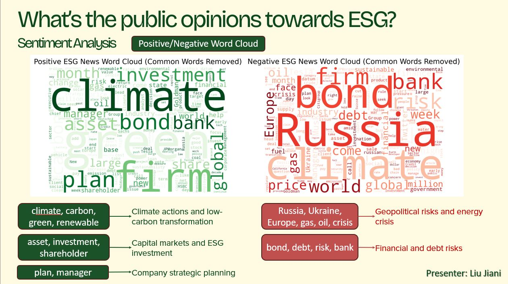
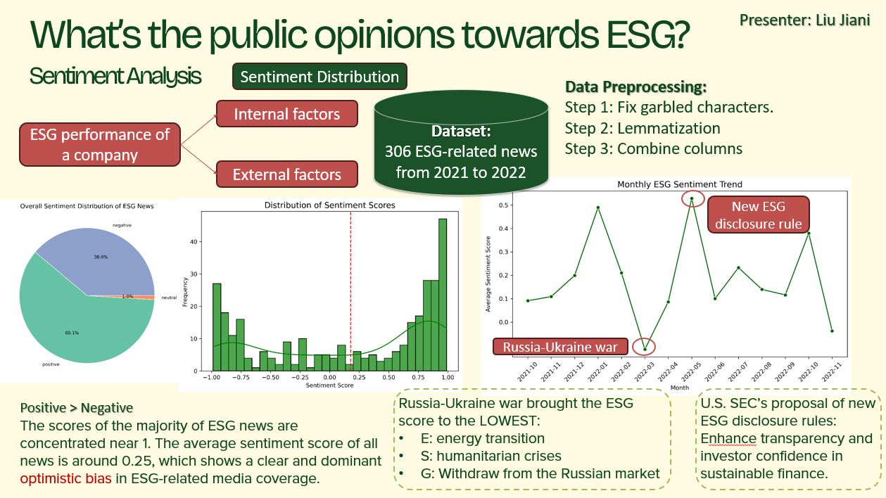

# 📊 ESG News Sentiment Analysis & Firm Performance

## 📝 Project Overview
This project leverages **Natural Language Processing (NLP)** and **Machine Learning** to uncover how public ESG narratives and firm-level factors jointly shape companies’ ESG scores. By analyzing 306 ESG-related news articles from 2021 to 2022, the model identifies specific sentiment trends and geopolitical drivers that impact sustainability evaluations.

## 🔍 Key Findings
Our analysis reveals critical patterns in how news sentiment reflects global events and corporate actions:
* **Sentiment Bias**: The overall sentiment in ESG media coverage is overwhelmingly **positive**, indicating a dominant optimistic bias in corporate sustainability reporting.
* **Geopolitical Impact**: The **Russia-Ukraine war** brought ESG sentiment scores to their lowest historical point, driven by energy transition risks, humanitarian crises, and market withdrawals.
* **Regulatory Influence**: The introduction of new **U.S. SEC ESG disclosure rules** created distinct sentiment spikes, aimed at enhancing investor confidence and transparency.

## 📸 Data Visualization

### 1. Word Cloud Analysis
We performed internal and external word cloud mapping to correlate narrative themes with ESG performance.

* **Internal Drivers**: Keywords like *month, firm, climate, asset,* and *manager* show how companies internally navigate long-term transformation.
* **External Risks**: Words like *Russia, crisis, gas, bond, debt,* and *bank* reflect the external geopolitical and financial risks that weigh down news sentiment.

### 2. Sentiment Trends & Preprocessing
The model reveals how monthly sentiment averages correlate with major global events. The pipeline included three core steps: fixing garbled characters, lemmatization, and column combination.

## 🛠️ Methodology & Tech Stack
* **Language**: Python (NLTK, Scikit-learn, Pandas)
* **NLP Techniques**: VADER/TextBlob Sentiment Analysis, K-Means Clustering, Lemmatization
* **Visualizations**: Matplotlib, Seaborn, WordCloud
* **Environment**: Jupyter Notebook

---
